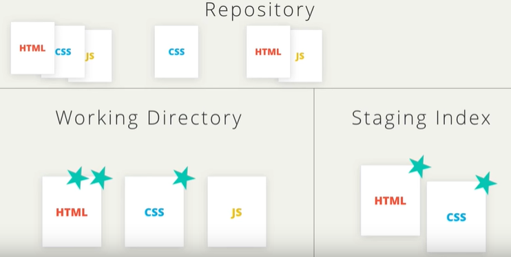

# Git

Git is a distributed version-control system for tracking changes in source code during software development [...](https://en.wikipedia.org/wiki/Git)

## Git vs GitHub vs GitLab

Git is a version control system that lets you manage and keep track of your source code history. GitHub is a cloud-based hosting service that lets you manage Git repositories.

Both [GitHub and GitLab](https://about.gitlab.com/devops-tools/github-vs-gitlab.html) are cloud-based hosting service for your git repositories.

## Terminology

### commit

Git thinks of its data like a set of snapshots of a mini filesystem. Every time you commit (save the state of your project in Git), it basically takes a picture of what all your files look like at that moment and stores a reference to that snapshot. So a commit is the fundamental unit in Git

### repo

A repository is a directory which contains your project work which are used to communicate with Git. Repositories can exist either locally on your computer or as a remote copy on another computer.

### Working directory

The Working Directory is the files that you see in your computer's file system.

### checkout

A checkout is when content in the repository has been copied to the Working Directory.

### Staging Area / Staging Index / Staging / Index

A file in the Git directory that stores information about what will go into your next commit.

### SHA

"SHA" is shorthand for "Secure Hash Algorithm". It is a 40-character string composed of characters (0–9 and a–f) and calculated based on the contents of a file or directory structure in Git.

### Branch

A branch is when a new line of development is created that diverges from the main line of development. This alternative line of development can continue without altering the main line.

## Create a repo from scratch

`git init`

Running the git init command sets up all of the necessary files and directories that Git will use to keep track of everything. All of these files are stored in a directory called [.git](https://git-scm.com/book/en/v2/Git-Internals-Plumbing-and-Porcelain)

config - where all project specific configuration are stored

description - only used for git web

HEAD - points to the checked out branch

hooks/ - this is where we could place client-side or server-side scripts [...](https://git-scm.com/book/en/v2/Customizing-Git-Git-Hooks)

info/ - contains the global excludes file

objects/ - contains all the commits we make

refs/ - contains pointers to commits (basically the "branches" and "tags")

git init [docs](https://git-scm.com/docs/git-init)

## Clone an existing repo

`git clone <URL of repo>`

`git clone <URL of repo> <New repo name>`

git clone [docs](https://git-scm.com/docs/git-clone)

## Status of the repo

The git status is our key to the mind of Git. It will tell us what Git is thinking and the state of our repository as Git sees it

`git status`

git status [docs](https://git-scm.com/docs/git-status)

## Displaying repo commits

`git log`

By default, this command displays:

- the SHA
- the author
- the date
- and the message

Truncate and display commits in oneline:

`git log --oneline`

- lists one commit per line
- shows the first 7 characters of the commit's SHA
- shows the commit's message

To answer the questions like, what files were changed? How was it changed?

`git log --stat`

- displays the file(s) that have been modified
- displays the number of lines that have been added/removed
- displays a summary line with the total number of modified files and lines that have been added/removed

The `git log` command has a flag that can be used to display the actual changes made to a file.

`git log -p` or `git log --patch`

- displays the files that have been modified
- displays the location of the lines that have been added/removed
- displays the actual changes that have been made

`git log -p --stat` will display the stats info above the patch info

`git log -p -w` will show the patch information, but will not highlight lines where only whitespace changes have occurred.

Avoid too much scrolling by just viewing a specific commit. There is two ways to accomplish that,

`git log -p <SHA>`

By supplying a SHA, the git log -p command will start at that commit. Just so you know, it will also show all of the commits that were made prior to the supplied SHA.

The other command that can be used to display commit is `git show`

`git show`

The above command will display the most recent commit

`git show <SHA>`

The above command displays the commit associated with the SHA.

`git show --stat 8aa6668`

The output of the git show command is exactly the same as the git log -p command. So by default, git show displays:

- the commit
- the author
- the date
- the commit message
- the patch information
